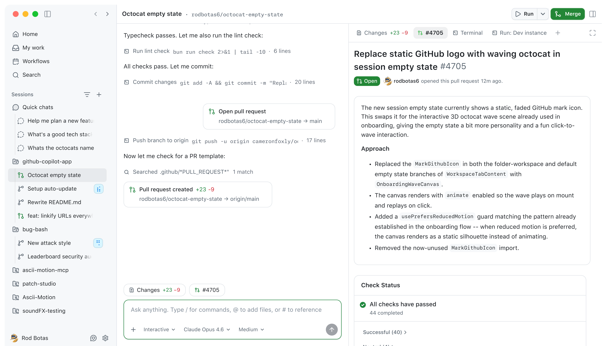

Until this year, my time talking with LLMs had been via messages in ChatGPT or Claude. I'd used them for coding, but the results hadn't been great.

I remember asking ChatGPT last year to scaffold code for an Ethereum Name Service CLI in Rust and the results were terrible — the code wouldn't compile, poor dependencies were selected and I didn't fancy throwing hours away getting it to work.

This changed with the new models that emerged at the tail end of 2025, which could write code reliably that would work.

However, throughout my own multi-year period of working with LLMs, my discussions had always been between me and my personal agent. There was no collaboration happening with them with a wider group — at best it was me exporting fragments of conversations to documents to share with others, but there was a lack of a collaborative process.

## Why agents need to be shared

For agents to fulfil their potential, they need to work well in a collaborative setting and be shared. You can't have teams going off and having their own individual conversations with personal agents and reporting back, they need to inhabit the same space as your colleagues and coworkers.

This missing collaborative tooling around shared agents is starting to be addressed, but it's still far from mature.

For those utilising Microsoft, Copilot support has been available since late last year, whereby teams can work with a shared agent via a group chat, which can access resources aligned with the Teams workspace. 

As with most Microsoft products, this is a configuration that works if you're all in on Microsoft's business offer and provides an integrated experience. Your agent also needs to be directed, due to context limitations it can't be across the details of the latest updates to projects in your org workspace.

The reality is that most organisations have a number of different platforms and services which they rely upon, limiting the reach of Copilot which is bound to one ecosystem. 

But this method of having agentic collaboration in group chats is something I expect to become commonplace for team collaboration. 

Outside of the Microsoft ecosystem, this is being achieved by setting up agent frameworks such as OpenClaw and Hermes on their own dedicated servers, and then connecting them into messaging apps such as Slack or Discord where they can live as shared or personal agents. 

If being used as a shared agent, they can be configured with access to project resources residing in shared collaboration spaces such as GitHub repos, Google Drives, email inboxes and calendars. Then team members can ask them to collaborate on work tasks whereby the whole team has visibility on the agent's inputs and outputs.

They too can be set up as personal agents, where they are hooked up to WhatsApp or Telegram, with access to someone's inbox and calendar and operate as a personal assistant to that person for private communication.

Both approaches provide all of the benefits of working with the frontier LLMs, but without having to go through the apps from those providers.

## Flexibility has a cost

With the harnesses provided by OpenClaw and Hermes, models can easily be switched out, without having to regrant access to project resources as they are managed by the agent framework.

This reduces vendor lock-in, whilst retaining flexibility in this ever evolving space. But with this flexibility, comes responsibility for much of the plumbing underneath.

There is little doubt that these shared and personal agents will continue to proliferate, but there are challenges with using them. Hermes and OpenClaw need to be regularly updated. Their access tokens to the underlying model provider they use often need to be refreshed — I've had this happen three times in one of my Hermes deployments the past few weeks alone, leaving my agents unusable until I logged onto the associated server they were running on and fixed this.

When you start connecting these frameworks to external services such as Google Drive, Slack, WhatsApp and others, there are also credentials and permissions which need to be managed, which is where things can become brittle.

Even for a small organisation and my own needs, I'm setting up integrations with WhatsApp, Telegram, Discord, GitHub, Google Drive, Xero, Calendar and Gmail, all of which have the potential to need reauthentication at some point and close attention needs to be paid to access control.

For instance, whilst giving readonly access to an email account for an agent to use may seem harmless, it isn't when you consider that multi factor authentication codes are often shared over email — are you comfortable with an agent being privy to this information?

Or if you're giving limited access to write files to a specific directory in Google Drive — can you be certain that it couldn't potentially access another directory if it was told of its identity by someone?

How about if you're getting an agent to make code changes in GitHub — with the access control token you've given to the agent, does it have the ability to commit directly to a project repo, or are you certain it can only submit pull requests?

These examples demonstrate the challenges there are in provisioning agentic infrastructure correctly.

## Shared coding agents

To reduce the complexity of these agent deployments, we're seeing other agentic frameworks emerge which may better support specific use cases. 

Claude Code and OpenAI's Codex have been two of the leading CLI tools for agentic development. But their usage is limited to running in terminals or using their own apps. 

OpenClaw and Hermes do provide a mechanism as outlined above for teams to collaborate on codebases, but it requires a lot of manual setup by teams. 

Recognising these challenges, GitHub recently launched their  [Copilot app](https://github.com/features/preview/github-app) (currently in technical preview) which provides a shared collaboration space for teams to work on their GitHub codebases alongside Copilot agents.

*The new GitHub Copilot app [(source)](https://github.com/features/preview/github-app)*

This will enable development teams to move beyond the singular conversations they have with coding agents and facilitate input from all members on what needs to be built.

If you want a more in depth breakdown, I recommend you check out Maggie Appleton's [post on it](https://maggieappleton.com/zero-alignment). 

Paradigm and Tempo also recently made public their [Centaur](https://centaur.run/) agent framework which provides secure coding agents over Slack. 

Centaur has been designed for team collaboration with a significant emphasis on security, with credentials kept separate from the agents themselves and containers for conversations restricting the ability of the agents to cause havoc.

Whilst these are a couple of recent examples, it seems inevitable that we'll see more agent frameworks launching that are built for specific types of work.

The frontier labs have been vocal about their focus on supporting developer workflows with their models, and now that developers are utilising agents to various degrees for their coding activities, it makes sense that the collaborations used by teams evolve to support this.

OpenClaw, Hermes and the others I've touched on are early to the party in providing the platforms that can be used to coordinate work among agents. We're at a transitional point, but over the coming months these platforms will proliferate as teams adopt them, supporting the next phase of growth in agentic workflows.
 
