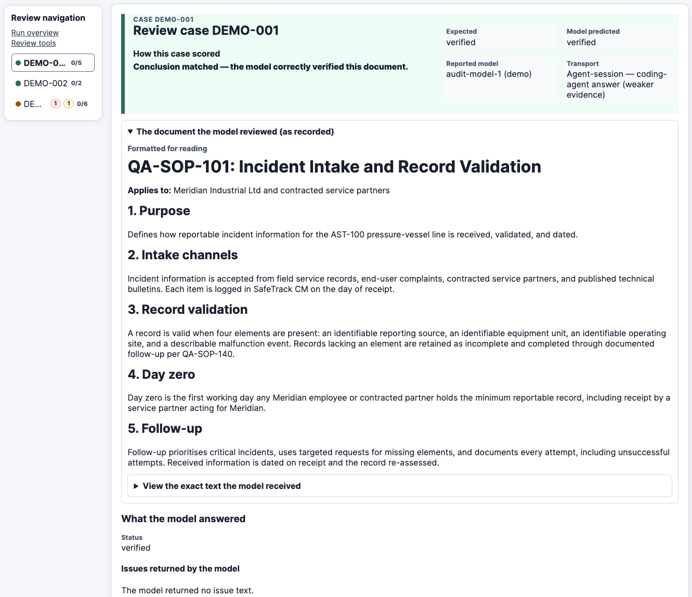
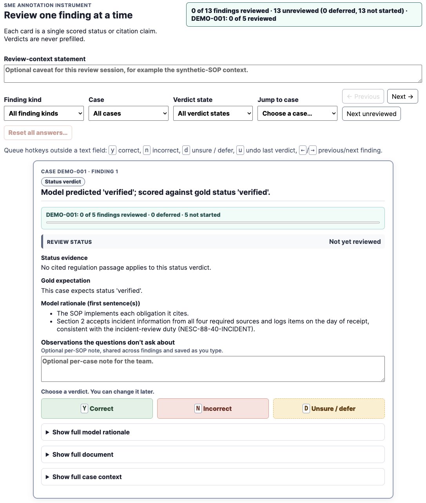

Recently I've been building out an evals framework for an audit use case. This has highlighted many of the challenges faced with using LLMs for regulated industries.

Audit processes entail a lot of process review via stakeholder interviews and document reviews. The benefits of using LLMs to assist with the document review process are obvious, but given LLMs are probabilistic in how they generate text you cannot guarantee consistent responses from them.

In addition, in order to further refine the LLMs to operate like a domain expert, you need to tune the model's configuration with the help of domain subject-matter experts (SMEs).

This is where evals frameworks help. They provide an environment whereby one can run multiple passes of an LLM query capturing the request and response from the underlying model, thus capturing the variance of false positives or hallucinations in a response. They also provide an environment for SMEs to review model outputs and provide feedback to refine the model.

For further background on evals I encourage you to refer to Hamel Husain's [excellent primer](https://hamel.dev/blog/posts/evals-faq/).

During an audit, there are large volumes of data that auditors need to be across. There can be hundreds of documents and overlooking or misinterpreting a single detail can be the difference between success or failure. 

It can also be a somewhat subjective process due to the approach taken by the people or company performing the audit, as well as requiring clarifications or supplementary evidence to support the audit.

Given these constraints, to properly optimise the audit process, you should be confident you are delegating the right tasks to the LLMs.

## Using the right data

In building out an evals framework, there are a number of core components you need to get right early on for audits. The first is having quality data to work from. In our specific case that took the form of 10 standard operating procedure (SOP) documents for validation. 

This number was intentional — we needed to ensure the quantity of documents was small enough that we could properly scrutinise the outputs of the LLM without drowning in content. This number would increase subsequently, but you want to start small.

Accompanying each SOP we have the gold dataset which specifies the expected outcome of our eval runs. This data is put together in collaboration with the SME to assess the success of our runs.

This data was structured as per the below.

```sh
data/
├── documents/sop-v1/          ← the SOPs themselves (markdown files)
│   ├── SOP-001.md              the things being audited
│   └── …
├── goldsets/sop-v1/           ← the answer key (CSV tabs)
│   ├── eval_verification.csv       one row per case: which document,
│   │                               expected status, expected citations,
│   │                               what the planted issue is
│   ├── reference-rationales.csv    why each expected citation applies +
│   │                               known-wrong citations to red-flag
│   └── manifest.yaml               provenance: fixture | signed_off
└── corpus/corpus-v1.csv    ← the regulation passages (one row per
                                    passage, with source provenance)
```

## Building the harness

For the LLM, we needed to create an eval harness to facilitate the model configuration. Picking one of the current frontier models such as Claude Fable or Opus, or GPT-5.6 is the best place to start, as the responses are likely to be better. You can easily experiment with cheaper models later, once you've nailed the evals process.

The starting point of this harness is likely to be a simple prompt such as the following, which you work with your coding agent to generate:

```
You are a careful [domain] document-verification assistant.

Assess the supplied document only against the supplied 
regulation passages.

Use the document evidence and passage text; do not invent facts, 
requirements, or citations. Cite only passage IDs that occur in 
the supplied corpus context. 

If the document lacks enough evidence to assess a requirement, 
explain that clearly. Return only a JSON object that conforms 
exactly to the supplied output schema.

Prompt version: verification-v2.
```

For the audit scenario, there is typically regulator documentation that the agent needs to be across, so relevant documents or passages from this, along with a simple prompt such as the above are enough to get you started.

The output schema is an important component of the prompt. You want the model to assess some input against regulatory requirements and produce structured responses.

```json
{
    "$defs": {
        "VerificationStatus": {
            "enum": [
                "verified",
                "issues found",
                "incomplete"
            ],
            "title": "VerificationStatus",
            "type": "string"
        }
    },
    "additionalProperties": false,
    "description": "The structured response contract, aligned to status values.",
    "properties": {
        "citations": {
            "items": {
                "type": "string"
            },
            "title": "Citations",
            "type": "array"
        },
        "issues": {
            "items": {
                "type": "string"
            },
            "title": "Issues",
            "type": "array"
        },
        "rationale": {
            "title": "Rationale",
            "type": "string"
        },
        "status": {
            "$ref": "#/$defs/VerificationStatus"
        }
    },
    "required": [
        "status",
        "issues",
        "citations",
        "rationale"
    ],
    "title": "VerificationOutput",
    "type": "object"
}
```

For communicating with the underlying model, you may choose to do it via your Codex or Claude Code subscription. This is fine initially, but not once you wish to export your model customisations to your main application. 

Coding agents have their own agent harness, with its own system prompts and tools which you can't readily replicate in production. Hence you want to ensure you're going directly via their API, recording the specific model version for each run.

## Evaluation and SME review

Once this simple eval harness has been created, you can kick off your initial run to see how well the LLM performs the role of auditor's assistant.

The purpose of this initial run is to generate some data that can be used for review by both your audit SME, as well as non-SMEs such as product or technical team members for obvious errors.

However, in its native form the output from the LLM is unlikely to be particularly user friendly which is why our focus now needs to shift to how best to present the findings for review.

A static HTML document is fine early on — it can easily be shared with your SME and other team members, and responses can easily be exported.

As the sophistication of your evals operations grows it can evolve into a platform and while it may be tempting to prompt your agent to go down that route at the start, there is no need at the early stages.

It's definitely worth investing time in getting the format right here. We found that we needed to iterate with how we presented the LLM generated response to our SME — our starting point was having a singular page which they had to scroll through, but they found this burdensome when reviewing 90 individual findings across our 10 input documents.


*The initial SME review document format we used, where a single long HTML page was shared with all findings for them to scroll through — note the transport shows a coding-agent session instead of direct to API as weaker evidence (fabricated data has been used for sharing here)*

Hence it evolved into a format where they could easily navigate between findings, inserting comments as they went.


*The updated SME review document format was broken down by finding with simple navigation (again fabricated data is shown)*

Once your SME and other team members sign off on this review format, you have your foundations to run evals and obtain SME feedback.

## Sharing the model configuration

There is one more task worth doing at this stage which is to define the export format of your tuned model setup. The simplest approach is to define a model metadata schema which contains items such as the prompt, model version, your output schema, commit hash/version information from the evals project. This is so you have an artefact that you can share with your main application for exporting your LLM configuration.

At this early stage it may seem overkill, but it's important to have provenance for decisions regarding the LLM configuration for your audit application.

With these building blocks in place, you're then ready to run your model evals. You should have a model selected along with your chosen prompt. Your evals framework should ensure that it captures all relevant information about runs including data sent to and received from the LLM. This includes the version of your model schema you used and hashes of any input documents shared with the model, such as regulatory corpora.

## Sizing eval runs

Due to the probabilistic nature of the underlying LLM, you will need to perform multiple runs of your query to look for a consistent result, with any failures being flagged.

The precise number of iterations should be determined by preliminary testing of your evals. We found that our worst performing issue was not being detected approximately 30% of the time. 

We wanted to have 95% confidence for these results, so we needed to ensure that this error is not detected in less than 5% of LLM eval runs.

9 runs gives us a 4.0% chance $(0.7^{9})$ of that happening on our most flaky issue. We went with 10 runs to lower this number further to 2.82% $(0.7^{10})$.

As the results of LLM assessments will be reviewed by auditors, we are ok with this low error rate, but it will evolve over time. For your own audit evals, you will need to decide what error rates you are comfortable with.

Furthermore, you will require a test dataset which can be used to evaluate the effectiveness of your model using data it hasn't seen before. This is for final verification of the model before you deploy it to the audit product that's utilising the model.

The end result of this is a functioning eval framework for audit whereby:

- You can evaluate and optimise the configuration of LLMs
- SMEs and team members can review and provide feedback on the quality of judgement by the LLM
- The optimum configuration for the LLM (model version, prompt, etc) can be shared for incorporation into your primary, user-facing application

This ensures that you can not only accurately measure, but also refine the way in which you utilise LLMs in your application. In the auditing of documents, this diligence is essential to build confidence in the capabilities of LLMs. 

Their ability to quickly summarise and evaluate data will ensure they significantly impact the auditing process, but without the right guardrails in place, their adoption will stall in regulated environments.


