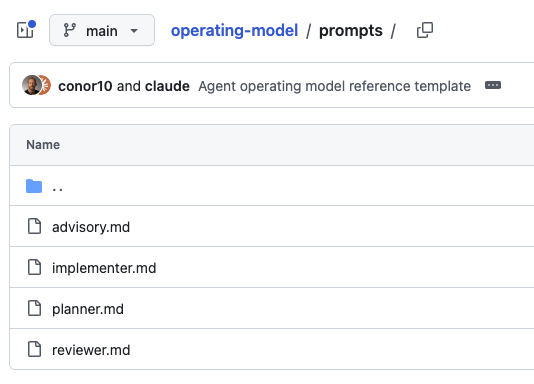

Agents excel at collaborating with individuals, less so with teams. The team collaboration challenges are well recognised, with a plethora of new tooling being created to cater for this including [QM](https://github.com/yc-software/qm), [Buzz](https://buzz.xyz/), [Xirp](https://xirp.spotify.com/), [Centaur](https://centaur.run/), [GitHub Copilot app](https://github.com/features/ai/github-app), [OpenClaw](https://openclaw.ai/), [Claude Tag](https://www.anthropic.com/news/introducing-claude-tag), and [Hermes](https://hermes-agent.nousresearch.com/) (some of which I covered [here](/writing/from-private-chats-to-shared-agents/)).

This explosion of tools highlights how much of an unsolved problem this is. Chat interfaces and coding agents for individuals do have a level of maturity with ChatGPT and Claude being well established for the former, and Claude Code, Codex, Cursor and Copilot for the latter.

This means it is easy for individuals to build applications with agents, but what about when you want to collaborate with others on them?

How do you know your approach to building with agents is similar to someone else's? Historically in software engineering, depending on the chosen toolchain, teams have standardised on specific frameworks and build systems.

With agentic engineering, this often goes out the window. If you're an engineer, it likely is still front of mind — you understand the various frameworks out there and appreciate what good looks like.

If you're less technical, do you simply delegate the decision to the agent?

In either case, how do you track the decisions along the way? How can you get input from other stakeholders? 

How about if you're using multiple agents from different vendors? You can't simply store the session history if you're jumping between Claude Code and Codex, or perhaps talking to agents via Slack or in other collaborative environments.

These are just some of the challenges faced with utilising agents for engineering if you want to have a collaborative approach to building software.

An important artefact to create is a standardised operating model for your team. This is a code repo that agents can be pointed at when creating new projects by anyone. This standardises how software gets built by agents. It encompasses the workflow, capturing of decisions, documentation and stakeholder input which your agents all work with.

As these rules are defined at the repo level, it doesn't matter how your team orchestrate their agents — the repo defines the rules by which they need to abide in their delivery of software, regardless of the chosen harness it's driven from.

This is now unpacked further.

## Agent-friendly structure

This is the most obvious feature, including agent-friendly markdown files so agents can quickly understand and use the repo.

The essential README.md, AGENTS.md and CLAUDE.md should be included.

## Coding workflow

How much autonomy is given to agents? Do you use multi-agent workflows? At what point do human operators come into the loop?

My current approach utilises Fable for planning and review, GPT Terra for implementation and human sign-off.

```
1. Planner / Architect: Claude, Fable, or another high-reasoning model plans the work.
2. Implementer: Codex / GPT edits code in the primary workspace.
3. Judge / Reviewer: Claude, Fable, or another independent model reviews the frozen diff.
4. Human: accepts direction, resolves tradeoffs, and decides whether to merge or deploy.
```

It's up to you whether you want to automate handover between the agents or do it yourself. My own personal perspective is that if your target is a production system, you should be across the details of what's being built. Hence, I manually review planning outputs before passing them for implementation, as well as review the implementation outputs.

This is challenging for less-technical people, but it's important to be able to stand behind the quality of what's being built.

If you do want to experiment with automated handoff, you can utilise protocols such as the [Agent Client Protocol (ACP)](https://agentclientprotocol.com/) that facilitates communication between tools and coding agents.

I would resist the temptation to add multiple layers of agent skillsets for coding tasks. More agents creates more to review and has the potential for more bloat. A leaner approach with better oversight results in a more maintainable system, especially in the earlier phases.

The ones we have are defined in the prompts directory of our operating model.



If you have multiple sub-agents for different roles it's much easier for the LLMs to go off on a tangent, which is why we want to keep the process simple.

There can be value here, with roles overseeing design, security, etc, but they result in more code being generated increasing the surface of code to maintain.

The output of this session should be a set of changes to the repo as a commit or pull request tied to the specific feature set, with inputs and outputs to each of the above steps captured.

## Capturing decisions

A lot of emphasis is being placed on the coding workflows being used by agents, but a commit log alone isn't enough for people (or agents) familiarising themselves with projects. You need to have a full record of how a project reached its current state and where its trying to go. 

This spans the project roadmap, current status and decisions made along the way.

These can be captured in the project root via ROADMAP.md, STATUS.md and DECISIONS.md.

Accompanying this you'll want to capture the agent-runs for each task they work through in the coding workflow outlined above. 

Assuming you're following this workflow, with each feature or deliverable you work on, you'll want to capture the following as a minimum:

- plan
- implementation prompt and output
- judge output

Tying this together, you have a manifest file which is associated with each run which summarises all of the artefacts associated with the feature request.

A sample manifest output taken from a recent project is below.

```sh
date: 2026-07-20
task: "Phase 5: findings/classification/citation task coverage, judge program (DEC-017), three-outcome scorer (DEC-016), exporter, regression tracking"
status: in_progress # 5c/5a/5d/5e/5h frozen (five Ships); 5b/5f pending team inputs (wave-2 data, SME labels)
planner_model: "claude-fable-5 (Claude Code; evals-skills eval-audit + validate-evaluator loaded)"
implementer_model: "GPT/Codex (gpt-5.6-terra via codex exec, operator-monitored)"
judge_model: "claude-fable-5 (Claude Code)"
operator: "Conor"
related_decisions: [DEC-004, DEC-010, DEC-011, DEC-013, DEC-014, DEC-016, DEC-017, DEC-018]
pull_request: "#42 (phase-5-coverage -> main)"
reviewed_shas: # PR head SHA pinned at each boundary's judge re-check — never the branch name
  5c: "0baa83c"
  5a: "91908ce"
  5d: "1006463"
  5e: "01affa5"
  5h: "348a81e"
commits: [] # the merge commit, recorded when the human freezes by merging
artifacts:
  - planner-output.md
  - implementer-prompt-5c.md
  - implementer-prompt-5a.md
  - implementer-prompt-5d.md
  - implementer-prompt-5e.md
  - implementer-prompt-5h.md
  - product-consumer-brief.md
  - implementer-summary.md
  - judge-output.md
```
*The manifest output summarises key information about the inputs and outputs used by your agentic workflows*

With this approach you have a full set of historical artefacts for your project, which makes it easier for multiple people or agents to collaborate independently as well as get up to speed on it.

My mental model for this is it being like an enhanced commit log. Before agentic workflows, it would have been impossible to perform this amount of documentation and housekeeping for projects, which is another benefit of these new workflows that are emerging.

## Documentation

Documentation still has a place in your projects. Reference material such as the architecture, operating model, runbook and any useful material associated with the project goes there.

The documentation can be equally for human consumption as well as agents. It's challenging to make sense of the decisions captured by agents — they read like concise notes which can be hard to fully comprehend, which is where human-friendly documentation is invaluable.

## Stakeholder inputs

All of the components of the operating model discussed so far are applicable to the build of any application. But, what about when you require specialist domain input from subject matter experts (SMEs) or business stakeholders?

Historically, requirements would have lived in task management systems, which would capture areas for input from these stakeholders. Now it's feasible to capture them directly in the project.

Not everyone is using agents to code, but most people are now using agents. Hence you can incorporate into your operating model task assignments and a register of domain-specific questions for your experts to answer.

They point their agents at your repo, and can get them to articulate where their input is required and they can provide it via their agents.

This enables them to collaborate on projects in a very cohesive manner, greatly speeding up the development of applications.

From their perspective, it is as simple as prompting from within Claude Code or Codex:

```
Mode: advisory only. Do not edit files, update registers, or change task statuses — report only.

Follow `AGENTS.md`. I am a business user, not a developer. Use plain language and do not assume I know the codebase.

I am: <your name, as it appears in task assignments>

Read the registers and tell me everything that is waiting on me:

1. `TASKS.md` — tasks assigned to me that are `open` or `in_progress`, and tasks marked `delivered` that are waiting on my acceptance.
2. `SME-REVIEW.md` — open domain questions I am the expert for, with the interim default each one is currently running on.
3. `STATUS.md` — anything in Current Gate, Blocked, or Next Step that needs a human decision from me.
4. `DECISIONS.md` — any decision still marked `Proposed`.
5. Open pull requests awaiting my review or merge, if the project uses them.

For each item, one line: what it is, why it is waiting on me, what it
unblocks, and the smallest action that moves it.

Order by impact: things blocking other people first, then by how long each has been waiting.

End by flagging anything that looks stale or wrong in the registers (missing assignee, a status that does not match reality) — flag only, do not fix.
```

This can still be performed via a separate task management application. However, the disadvantage there is that it creates a 3rd-party dependency with additional context for your application.

With this approach, everything lives in a code repository, providing a fully auditable history of how your application came to be and all of the key decisions made along the way to get there.

## Additional context

External knowledge sources that are accessed via MCP services or retrieval-augmented generation (RAG) are considered project-specific sources. These live within your top-level AGENTS.md file, or in a knowledge-specific file such as docs/KNOWLEDGE.md.

They would be defined on a project by project basis.

## Build your own operating model

If you're interested in building your own operating model based on what I've discussed here, I have a version of mine available [here](https://github.com/conor10/operating-model) that you can use. Just point your agent at it to get started.

## Summary

Every week there is a new trend about how software should be developed with agents. 

Agentic development does bring with it a new paradigm of working, but this doesn't change the underlying principle of keeping everything simple.

It's all too easy to go off on a tangent, and instead of embracing the latest cool technique, I would focus on ensuring you establish a standardised operating model that works well for your specific use case, facilitating:

- multi-agent workflows with human oversight
- the capture of key decisions, agent prompts and outputs
- collaboration with other team members, including non-technical stakeholders

With these bases covered you'll find you have a good foundation for agentic development, with the guardrails that ensure you can build productively with them, while keeping human judgement in the loop.


