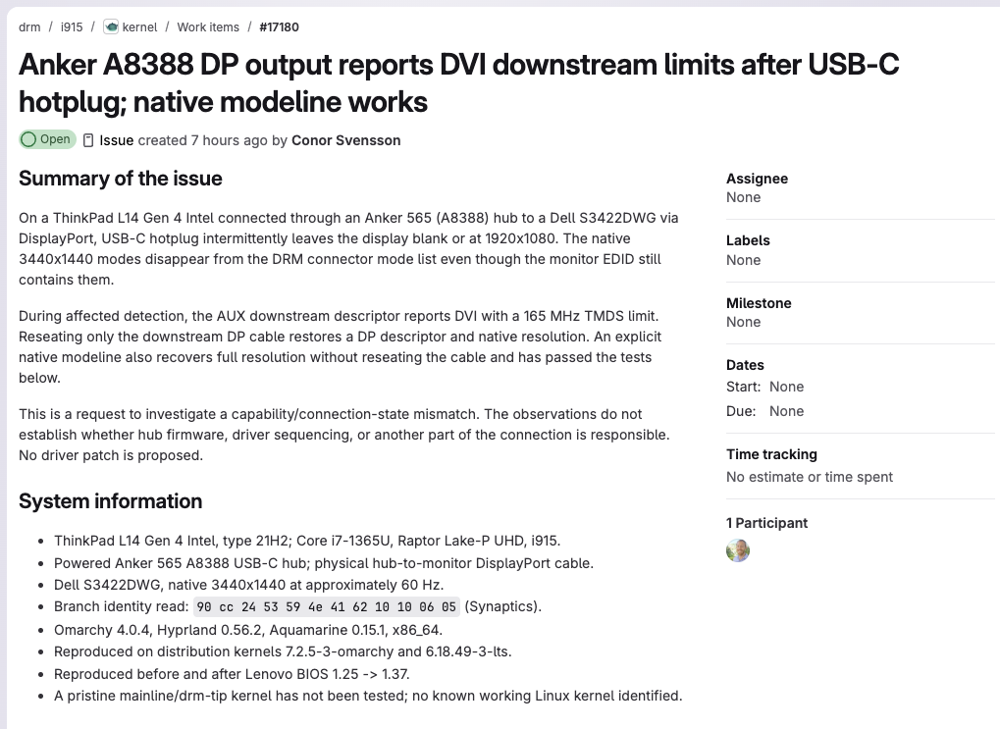
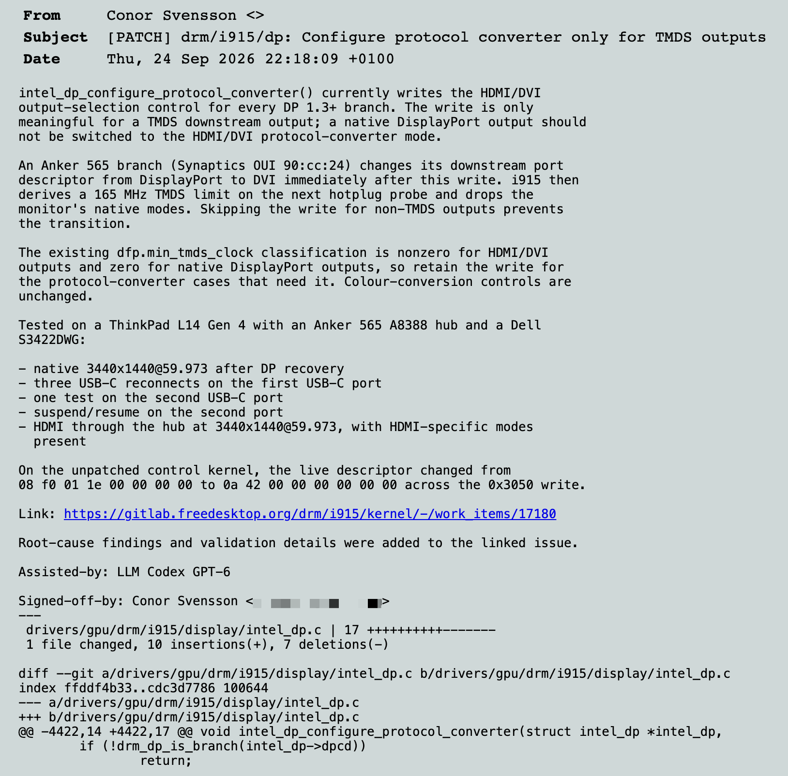

Unix based operating systems have always been my true love. But they've always been impractical as everyday work machines until now.

Omarchy is a new Linux operating system for the agentic world and it's a huge deal — up there with coding agents in its impact, and I'm going to explain why.

I first started playing with operating systems in the 90s. SUSE Linux was the first Linux distribution I explored. I installed it on a [Tiny PC](https://en.wikipedia.org/wiki/Tiny_Computers) and whilst it installed fine alongside my Windows 95 dual-boot setup, I could never get it to work quite right — I could never figure out how to get my sound card working properly and the monitor firing at full resolution with true colour support.

In the years that followed I spent a lot of time working with Sun's Solaris and Linux where I had unsuccessful experiments trying to get [OpenSolaris](https://en.wikipedia.org/wiki/OpenSolaris) working on my Acer Aspire laptop, and I ended up switching to Gentoo after realising OpenSolaris was never going to eclipse Linux. But there were always niggles that stopped everything just working, which I'd [rant about](/archive/blogspot/joys-of-new-acer-laptop-opensolaris/) occasionally.

However, by the late 2000s I'd switched over to MacBooks and OS X. I loved having the availability of a Unix terminal and things that just worked.

It didn't change my positive affection for Linux, but from a practical standpoint I didn't want to have to spend my time debugging device drivers and system settings to get everything working properly on my everyday workhorse. I needed things to just work.

A couple of years ago I did set up a laptop on Ubuntu, but again the default out the box experience wasn't great. It worked, but the UI felt clunky, I had issues with getting Chromium browser working properly and it still felt like it would be a ton of effort to get something that came close to my MacBook in terms of satisfaction when using it.

With my ongoing focus on AI evals and agentic engineering, I've been sufficiently preoccupied not to think any further about Linux. That was until I heard DHH's [conversation with Lex Fridman](https://www.youtube.com/watch?v=NYFGCESmikA) about Omarchy Linux.

## Installing Omarchy

I listened to the episode primarily to hear about DHH's current agentic development practices, but when he started describing Omarchy as a Linux distribution designed for developers in the agentic era it captured my attention. Furthermore when he mentioned that it can be installed from scratch in less than a minute on a machine, I had to act.

I picked up a ThinkPad L14 I had lying around and decided to put it to the test. Sure enough, after answering a few simple questions (computer name, your login, password, etc) the install itself was completed in 1 minute 4 seconds!

*Omarchy takes speed seriously, right from the install screen. The current install record is 35 seconds!*

Running Omarchy has had a similar impact to using my first coding agent. It's enabled me to envisage a future where Linux on the laptop can finally fulfil its potential.

DHH has been very intentional in building Omarchy for speed and cutting out all of the crap that adds friction to the user experience.

There are keyboard shortcuts for everything, using Omarchy's Super key (cmd on Mac/Windows key on Windows) you can launch terminals, browsers, apps. Additionally they are nicely tiled so you don't need to rearrange them when they launch.

It comes with many of the apps you need ready to install without having to go to a website — a Chrome-based browser, WhatsApp, YouTube, X, Discord, VS Code and many others.

There's even native screen recording, dictation and a stay-awake toggle.

AI tools are natively supported — Claude Code and Codex come ready to launch, others can easily be installed via its UI such as OpenClaw, ChatGPT desktop, Hermes Desktop and others.

Additionally the keyboard latency is kept very low making the whole experience feel very responsive. I'm writing this on my MacBook and it feels sluggish after using Omarchy!

For more of the specifics, DHH has an [excellent video](https://www.youtube.com/watch?v=F7fe9pa8OeE) where he runs through them all.

## The opportunity for Omarchy

Beyond gushing about how impressed I am with it, it has made me pause to consider what the implications are of Omarchy. Linux is an open source operating system, the packages it runs are also open source. This means that all of the current breed of LLMs will have been trained on the code that makes up the Linux ecosystem.

In practical terms what this means is that coding agents are excellent at solving problems with Omarchy. Whenever you hit a snag, you can easily invoke an agent to fix it. This is a huge unlock for Linux users. In the past resolving device issues required trawling through forums, installing or updating packages by hand, modifying config files, restarting services. The agent now takes care of this and can keep working until your problem is fixed.

Better yet, once it finds the fix it can submit the fix for inclusion in the associated driver or distribution preventing others from experiencing the same issue.

When testing Omarchy on my laptop, I hit an issue with my Anker hub not reconnecting to my Dell monitor. I set an agent going which diagnosed the issue and submitted an issue report.

*Working with my agent it was able to submit an issue report for the specific problem I was seeing (see the issue report [here](https://gitlab.freedesktop.org/drm/i915/kernel/-/work_items/17180))*

I was then able to get it to develop and submit the code fix for the Linux kernel!

*My agent was even able to put together the kernel patch submission (see the full submission [here](https://lkml.org/lkml/2026/9/24/2988))*

This ability for any user to easily fix and submit fixes via their agent is likely to have a compounding effect on how good Omarchy and Linux can get. Unlike other distros such as Ubuntu, there is no legacy that needs to be maintained, or enterprise customer base that needs to be serviced.

This will enable Omarchy to move incredibly fast and create a version of Linux which supersedes any that has gone before, as it can just work.

With this coupled with the team's obsessiveness with regards to the speed and slickness of its user experience, I find it hard not to envisage a future where Omarchy and therefore Linux can become a very viable option for running on people's laptops and desktops.

Regular people have historically had little incentive to use Linux. It requires a level of persistence and expertise beyond what most people are willing to commit to. Omarchy provides a user experience that is simpler and faster for people to come to grips with.

I believe this is a compelling enough hook that we may see the first real shift towards Linux on people's laptops that we have seen in over 30 years, and I cannot help but be excited by this.

